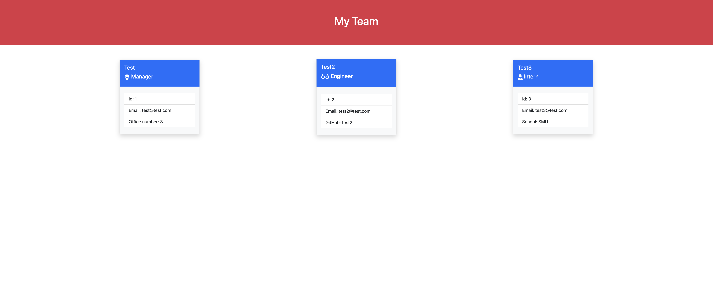

# Team Profile Generator

## Description

This project will allow the user to create a profile for their team by generating HTML that will render on the screen.

## Table of contents

- [Description](#description)
- [ScreenShot](#screenshot)
- [Screencast](#screencast)
- [Installation](#installation)
- [Usage](#usage)
- [Contributing](#contributing)
- [Tests](#tests)
- [License](#license)
- [Questions](#questions)

## Screen Shot

## Screencast Link

## Installation

To install necessary dependencies, run the following command:

npm install

## Usage

node index.js

## Contributing

na

## Tests

To run tests, run the following command:

npm run test

## License

This project is licensed under the MIT license.

## Questions

If you have any questions about the repo, open an issue or contact me directly at keonakirby@gmail.com. You can find more of my work at https://github.com/KeonaK
